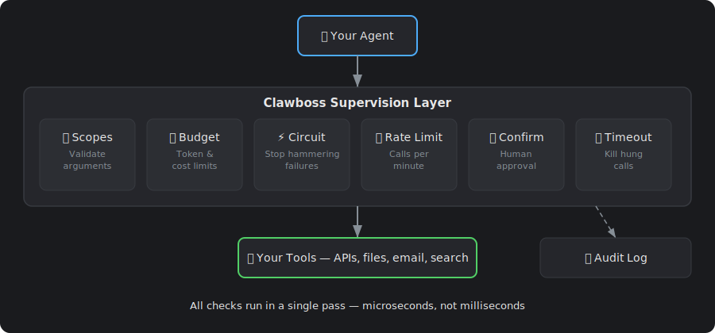

# Clawboss 


[](https://github.com/arunvenkatadri/Clawboss/actions/workflows/ci.yml)
[](https://www.python.org/downloads/)
[](LICENSE)
[]()

**Stop your AI agents from going rogue and set your long acting agents up for success.** Clawboss wraps tool calls with timeouts, budgets, circuit breakers, and audit logging so one bad tool call doesn't drain your wallet or loop forever.

Zero dependencies. Works with **any agent framework** — LangChain, CrewAI, AutoGen, OpenClaw, your own custom loop, whatever. Just wrap your tool calls. Includes durable sessions that survive restarts, a REST control plane, and a [dashboard](#dashboard) for managing everything in one place.

> **Clawboss is built for long-duration agents** — agents that run for hours or days, not minutes. Read [the manifesto](docs/manifesto.md) for the full vision.

## Why

You deploy an agent. It calls a flaky API in a loop. 47 times. At $0.03 per call. At 3am. Nobody's watching.

Or: your agent decides to "keep researching" and burns through your entire token budget in one conversation. Or: a tool hangs for 90 seconds and your user stares at a spinner.

Clawboss is the guardrail layer between your agent and its tools. Every tool call goes through supervision — timeouts, budgets, circuit breakers — so you can deploy agents without white-knuckling it.

<p align="center">
  
</p>

### No arbitrary code downloads

Most agent platforms want you to install skills from a community marketplace — arbitrary code that runs unsandboxed in your agent's process. One bad plugin and your agent has full access to your filesystem, credentials, and network.

Clawboss takes a different approach. **You define skills and agents declaratively** — what tools are available, what parameters they accept, what supervision limits apply. No downloading stranger code. No hoping someone reviewed that community plugin before you installed it. You control exactly what your agents can do, and every tool call goes through supervision whether you built it or someone else did.

## Install

```bash
pip install clawboss
```

## Quick start

```python
import asyncio
from clawboss import Supervisor, Policy

# Define limits
policy = Policy(
    max_iterations=5,       # max tool call rounds
    tool_timeout=15.0,      # seconds per tool call
    token_budget=10_000,    # total token cap
)

supervisor = Supervisor(policy)

# Your tool function (any async callable)
async def web_search(query: str) -> str:
    # ... your implementation ...
    return f"Results for: {query}"

async def main():
    # Supervise a tool call
    result = await supervisor.call("web_search", web_search, query="python async")

    if result.succeeded:
        print(result.output)
    else:
        print(f"Failed: {result.error.user_message()}")

    # Track token usage from your LLM calls
    supervisor.record_tokens(1500)

    # Finish and get final stats
    snapshot = supervisor.finish()
    print(f"Used {snapshot.tokens_used} tokens in {snapshot.iterations} iterations")

asyncio.run(main())
```

## Dashboard

Open `dashboard.html` in a browser for a full management UI:

- **Agents** — create, edit, deploy, and manage agents. Each agent has a system prompt, task, assigned skills, policies, budget overrides, and an optional POML pipeline. Agents persist to localStorage across refreshes.
- **LLM-powered agent builder** — describe what you want in plain English. Claude generates a system prompt, picks the right skills and policies, sets a schedule, suggests budgets, and creates a multi-step pipeline — all auto-applied. Hit "Refine" to iterate on the prompt.
- **Live chat** — open a conversation with any agent directly from the dashboard. Messages go through a real LLM with full clawboss supervision (budgets, iterations, timeouts, circuit breakers). Tool calls are visible in the chat.
- **Deploy** — click Deploy on an agent card to create a supervised session and auto-run the agent's task. The chat panel opens and shows the agent working.
- **Skills** — define reusable capabilities (tool collections) and assign them to agents
- **Pipeline editor** — visual step builder with drag-to-reorder, or describe the pipeline in natural language and let Claude generate the POML. Toggle between visual and raw POML views.
- **Budget overrides** — set token budget, dollar budget, max iterations, and tool timeout directly on each agent. Values override assigned policies. Live cost estimates update as you type.
- **Sessions** — live view of running agent sessions from the REST API, with pause/resume/stop controls, budget usage, and audit logs. Updates in real time via WebSocket.
- **Approvals** — pending tool approvals show as yellow cards with Approve/Deny buttons
- **Costs** — track spend, set budgets with hard stops, view usage over time
- **Policies** — see all active supervision rules at a glance

The Sessions tab connects to the REST control plane (`uvicorn clawboss.server:app`) and shows real-time session data. Agent cards show live status and controls work against the real API. The LLM features (prompt generation, chat, pipeline generation) require a backend with an LLM API key — use [Artemis](https://github.com/arunvenkatadri/artemis) or provide your own `/chat` and `/generate-prompt` endpoints.


## What it does

| Feature | What it prevents |
|---------|-----------------|
| **Tool timeout** | A single tool call hanging forever |
| **Token budget** | Runaway LLM costs blowing through your budget |
| **Iteration limit** | Agent loops that never converge |
| **Circuit breaker** | Hammering a tool that keeps failing |
| **Dead man's switch** | Agent going silent (no activity for N seconds) |
| **Confirmation gates** | Dangerous tools running without human approval |
| **Audit log** | Not knowing what your agent did |
| **Privacy shielding** | PII leaking through tool calls to LLMs or APIs |
| **Observability + cost attribution** | No visibility into tool latency, error rates, or real dollar cost per agent/session/model |
| **Context compression** | Agent forgetting its instructions mid-conversation |
| **Tool scoping** | Agents calling tools with dangerous arguments |
| **Durable sessions** | Agent dies mid-task, loses all progress |
| **Crash loop protection** | Agent keeps crashing and restarting forever |
| **16 guardrails** | No layered safety — rule-based + LLM-backed checks for every tool call |
| **Reflection loops** | Agents looping without thinking about whether they're making progress |
| **Session replay** | No way to reconstruct what an agent did after the fact |
| **Streaming inputs** | No way to react to real-time events (Kafka/Kinesis/Redis) |
| **Triggers & scheduling** | No way to run agents on schedule or on data events |
| **Pipeline orchestration** | No structured way to chain tool calls |
| **REST control plane** | No way to pause/resume/stop agents remotely |

## Works with any agent framework

Clawboss doesn't care what framework you use. It supervises tool calls — any async or sync callable. If your agent calls tools, Clawboss can wrap them.

```python
# LangChain? Wrap your tools.
# CrewAI? Wrap your tools.
# AutoGen? Wrap your tools.
# Custom loop? Wrap your tools.
# OpenClaw? There's a built-in bridge (see below).

result = await supervisor.call("my_tool", my_tool_fn, **kwargs)
```

## Tool scoping

Scopes are policies that validate tool arguments before execution. Instead of just "can this agent call write_file?" you control "can this agent call write_file *with this path*?"

```python
policy = Policy.from_dict({
    "tool_scopes": [
        {
            "tool_name": "write_file",
            "rules": [
                {"param": "path", "constraint": "allow", "values": ["/tmp/*", "/home/user/output/*"]},
            ],
        },
        {
            "tool_name": "send_email",
            "rules": [
                {"param": "recipient", "constraint": "allow", "values": ["*@mycompany.com"]},
            ],
        },
        {
            "tool_name": "web_search",
            "rules": [
                {"param": "query", "constraint": "block", "values": ["internal", "confidential"]},
            ],
            "max_calls_per_minute": 10,
        },
    ],
})
```

Scopes are just another type of policy. Assign them to agents the same way — a scope-only policy has zero supervision fields and one or more tool scope rules. Stack them with budget and rate-limit policies on the same agent.

Constraint types:
- **allow** — parameter must match at least one pattern (glob with `*` and `?`)
- **block** — parameter must NOT match any pattern
- **match** — parameter must match at least one regex

## Context compression

Long-running agents drift. They forget their original instructions, blow past constraints, and hallucinate prior context. Clawboss solves this with **supervision-anchored compression** — a novel approach that only works because you have a supervision layer.

The key insight: supervised agents can compress more aggressively than unsupervised ones. Safety-critical state (policies, budgets, circuit breakers) is enforced by the supervisor, not by the LLM's memory. So you never need to keep that in context — it's reconstructed fresh every turn.

```python
from clawboss import Supervisor, Policy
from clawboss.context import ContextWindow

supervisor = Supervisor(Policy(max_iterations=10, token_budget=10000))
ctx = ContextWindow(supervisor, max_recent_turns=10, skill_name="research")

# Add turns as the conversation progresses
ctx.add_turn("user", "Search for quantum computing breakthroughs")
ctx.add_turn("assistant", "Searching...", tool_calls=[...])

# Get the full context for your LLM prompt
prompt = ctx.to_prompt()

# When context gets long, compress older turns
result = await ctx.compress()
prompt = result.to_prompt()
```

The context has three zones:

| Zone | What it contains | Fidelity |
|------|-----------------|----------|
| **Anchored state** | Budget, circuit breakers, policies, confirmed tools | Always fresh from supervisor |
| **Compressed history** | Older turns summarized by tool calls and snippets | Lossy but safe |
| **Recent turns** | Last N turns | Full fidelity |

The anchored state is never compressed — it's rebuilt from the supervisor's live state every turn. Even if the LLM "forgets" its budget limit, the supervisor still enforces it. Bring your own LLM summarizer for richer compression, or use the built-in audit-based extraction.

## Pipeline orchestration

Chain tool calls into supervised sequential pipelines. Output flows from one step to the next — every step goes through full Clawboss supervision (timeouts, budgets, circuit breakers, PII redaction, approvals).

```python
from clawboss import Pipeline, SessionManager, MemoryStore

store = MemoryStore()
mgr = SessionManager(store)

result = await (
    Pipeline(mgr, "researcher", policy_dict={"max_iterations": 10, "token_budget": 50000})
    .add_step("web_search", search_fn, query="quantum computing")
    .add_step("summarize", summarize_fn)
    .add_step("write_report", write_fn, title="Research Report")
    .run()
)

print(result.completed)     # True
print(result.final_output)  # The report
print(result.total_duration_ms)
```

Pipelines stop early if a step fails, the budget is exceeded, or a tool needs approval. Each step is recorded in the observer, audit trail, and session payload.

### Build pipelines from natural language

Describe what you want in plain English. The LLM generates POML, which gets parsed into an executable pipeline.

```python
from clawboss import PipelineBuilder

# Auto-discover schema so the LLM writes correct SQL
schema = await sql.discover_schema()
builder = PipelineBuilder(my_llm, available_tools, mgr, db_schema=schema)

pipeline = await builder.create(
    "Check the alerts table. If there are more than 10 critical alerts, "
    "escalate to the on-call team. Otherwise log that everything is fine."
)
result = await pipeline.run()
```

The intermediate POML is human-readable, editable, and version-controllable:

```xml
<pipeline>
  <step tool="sql.query">
    SELECT count(*) as cnt FROM alerts WHERE severity='critical'
  </step>
  <threshold key="rows.0.cnt" value="10">
    <above tool="escalate">Notify on-call team</above>
    <below tool="log_ok">Log all clear</below>
  </threshold>
</pipeline>
```

You can also generate just the POML for review, then parse and run it:

```python
poml = await builder.create_poml("Check alerts and escalate if critical")
# Review/edit the POML...
pipeline = parse_pipeline_poml(poml, tools, mgr, "agent-1", policy)
result = await pipeline.run()
```

Refine with feedback:

```python
updated_poml = await builder.refine(poml, "Add an email notification step at the end")
```

### Conditional routing

Add branching logic — route to different steps based on the previous output:

```python
result = await (
    Pipeline(mgr, "monitor", policy)
    .add_step("check_alerts", sql.query, sql="SELECT count(*) as cnt FROM alerts")
    .add_condition(
        lambda output: output["rows"][0]["cnt"] > 10,
        then_step=("escalate", escalate_fn),
        else_step=("log_ok", log_fn),
    )
    .run()
)
```

Or use the threshold shorthand:

```python
pipeline.add_threshold(
    key="rows.0.cnt",     # dot-notation path into previous output
    threshold=10,
    above_step=("escalate", escalate_fn),
    below_step=("log_ok", log_fn),  # or None to skip
)
```

### Database connectors

Query SQL and NoSQL databases as supervised tool calls. Results flow through PII redaction, audit logging, and observability like any other tool.

```python
from clawboss.connectors import SqlConnector

sql = SqlConnector("sqlite:///data.db")  # also: postgresql://, mysql://

# In a pipeline
result = await (
    Pipeline(mgr, "analyst", policy)
    .add_step("get_orders", sql.query, sql="SELECT * FROM orders")
    .add_step("analyze", analyze_fn)
    .add_step("report", write_fn)
    .run()
)
```

Read-only by default — `SqlConnector("...", allow_write=True)` to enable writes. Supports parameterized queries and configurable `max_rows`.

Also ships `MongoConnector` for MongoDB (`find`, `insert`).

### Schema auto-discovery

Connectors introspect the database and expose the schema to the LLM so it writes correct SQL:

```python
sql = SqlConnector("sqlite:///data.db")
schema = await sql.discover_schema()
# {"tables": [{"name": "orders", "columns": [{"name": "id", "type": "INTEGER", "pk": true}, ...], "row_count": 1500}]}

# Human-readable format for prompts
print(sql.schema_to_text(schema))
# Table: orders (1500 rows)
#   - id INTEGER (PK)
#   - product TEXT
#   - amount REAL
```

When using `PipelineBuilder`, pass the schema and the LLM sees the actual tables:

```python
schema = await sql.discover_schema()
builder = PipelineBuilder(my_llm, tools, mgr, db_schema=schema)
pipeline = await builder.create("Show me total revenue by region")
# LLM writes: SELECT region, sum(amount) FROM orders GROUP BY region
```

The REST endpoint `GET /pipelines/schema` returns the schema for all registered connectors. The dashboard shows it in the pipeline editor.

## Reflection loops (agents that actually think)

Long-duration agents don't just loop `run()` forever. They think → act → observe → reflect → think again. Each phase is its own LLM call, each phase is audited, and the reflection output feeds into the next think phase.

```python
from clawboss import ReflectionLoop, SessionManager, MemoryStore

mgr = SessionManager(MemoryStore())

loop = ReflectionLoop(
    manager=mgr,
    agent_id="research-agent",
    goal="Write a report on quantum computing in 2026",
    llm=my_llm,
    tools={"search": search_fn, "take_notes": notes_fn, "write": write_fn},
)

result = await loop.run(max_cycles=20)
print(result.final_answer)
print(result.cycles_used)
for c in result.cycles:
    print(f"  {c.thought} → {c.tool_called} → {c.reflection}")
```

Each cycle is fully supervised. Guardrails apply. Crashes are recoverable. Every reflection is in the audit log. This is what distinguishes "agent ran for 72 hours doing useful work" from "agent ran in circles for 72 hours."

See `examples/long_running_agent.py` for a full reference implementation.

## Session replay

Every session's audit log is a complete record of what the agent did. `SessionReplay` reconstructs the timeline step by step — every tool call, every decision, every guardrail check, every state change.

```python
from clawboss import SessionReplay

replay = SessionReplay(mgr, session_id)
summary = replay.summary()
print(f"{summary.total_tool_calls} calls over {summary.duration_ms}ms")
print(f"Unique tools: {summary.unique_tools}")

# Walk through the timeline
for frame in replay.frames():
    print(frame.summary)

# Jump to a specific point
state_at_cycle_10 = replay.state_at(frame_index=10)

# Filter to just tool calls
tool_frames = replay.filter(phase="tool_call", outcome="allowed")
```

Available via REST at `GET /sessions/{id}/replay`. No new storage — it's built from the audit log you already have.

## LLM decisions (agents that actually decide)

Rule-based threshold routing is fine for known conditions. For agents that need to *interpret* input and decide what to do, use `add_llm_decision()` — a pipeline step that calls your LLM with a prompt template, parses structured JSON output, and feeds it to the next step for routing.

```python
pipeline = (
    Pipeline(mgr, "fraud-detector", policy)
    .add_step("enrich", enrich_fn)
    .add_llm_decision(
        my_llm,
        prompt_template="""
        Transaction: {input}
        Historical context: {context}

        Decide the action. Return JSON:
        {"action": "block|approve|escalate", "reason": "..."}
        """,
        include_context=True,  # passes session payload as {context}
    )
    .add_condition(
        lambda out: out["action"] == "block",
        then_step=("block", block_fn),
        else_step=("approve", approve_fn),
    )
)

await pipeline.run(initial_input=stream_message)
```

The LLM sees the previous step's output as `{input}` and (optionally) the session payload as `{context}`. It returns structured JSON, which the pipeline routes on. Bring your own LLM — same pattern as `SkillBuilder`.

## Stateful context with with_context()

Stream agents that need to see history — the last N messages, running averages, user state — can reuse a single session across multiple pipeline runs. The session payload accumulates automatically.

```python
# Start a long-lived session
sid = mgr.start("stream-agent", policy)

# Each stream message runs through the pipeline with shared context
async def on_message(msg):
    return await (
        Pipeline(mgr, "stream-agent", policy)
        .with_context(sid)          # reuse session, don't auto-stop
        .add_step("enrich", enrich_fn)
        .add_llm_decision(my_llm, prompt, include_context=True)
        .add_condition(...)
        .run(initial_input=msg)     # stream message flows into first step
    )

kafka = KafkaStreamConnector(..., on_message=on_message)
await kafka.start()
```

The pipeline keeps a rolling history (last 20 runs) in `session.payload["history"]`, visible to LLM decision steps via `{context}`. Each message's decision builds on the accumulated state.

## Streaming inputs

Subscribe agents to real-time event streams. Each message fires the agent pipeline with the message payload as input.

```python
from clawboss import KafkaStreamConnector

async def on_message(payload):
    # Run pipeline with the message as input
    return await pipeline.run()

kafka = KafkaStreamConnector(
    bootstrap_servers="localhost:9092",
    topic="agent-events",
    group_id="my-agent",
    on_message=on_message,
)
await kafka.start()
```

Three streaming backends — install only what you need:

| Connector | Install | Use for |
|-----------|---------|---------|
| `KafkaStreamConnector` | `pip install clawboss[kafka]` | Self-hosted, enterprise, replay, consumer groups |
| `KinesisStreamConnector` | `pip install clawboss[kinesis]` | AWS-native event streams |
| `RedisStreamConnector` | `pip install clawboss[redis]` | Simpler deployments, already-have-Redis |

Or install all three: `pip install clawboss[streams]`

All three use at-least-once delivery — messages are acknowledged only after the handler completes successfully. If the agent crashes mid-processing, the message is redelivered.

## Triggers and scheduling

Run pipelines on a schedule, on webhook, or when data changes.

```python
from clawboss import Scheduler, WebhookTrigger

scheduler = Scheduler()

# Every 15 minutes
scheduler.add_interval("check-alerts", pipeline.run, minutes=15)

# Cron schedule (every day at 9am)
scheduler.add_cron("morning-report", pipeline.run, cron="0 9 * * *")

# When a database condition fires
scheduler.add_db_watch(
    "new-orders",
    pipeline.run,
    connector=sql,
    query="SELECT count(*) as cnt FROM orders WHERE processed=false",
    condition=lambda r: r["rows"][0]["cnt"] > 0,
    poll_seconds=60,
)

scheduler.start()  # runs in background thread
```

Webhooks fire when an HTTP endpoint is called:

```bash
curl -X POST http://localhost:8000/triggers/deploy-notify/fire
```

REST endpoints:

| Method | Path | Description |
|--------|------|-------------|
| GET | `/triggers` | List all triggers |
| GET | `/triggers/history` | Trigger firing history |
| POST | `/triggers/{name}/fire` | Fire a webhook trigger |
| POST | `/triggers/{name}/enable` | Enable a trigger |
| POST | `/triggers/{name}/disable` | Disable a trigger |
| DELETE | `/triggers/{name}` | Remove a trigger |

The dashboard shows trigger mode selection in the agent creation flow — on-demand, interval, cron, webhook, or DB watch.

## Durable sessions

Long-running agents survive process restarts. Clawboss checkpoints supervisor state (iterations, token usage, circuit breaker states) to a pluggable store after every operation.

```python
from clawboss import SessionManager, SqliteStore

store = SqliteStore("sessions.db")  # or MemoryStore() for testing
mgr = SessionManager(store)

# Start a session
session_id = mgr.start("my-agent", {
    "max_iterations": 20,
    "tool_timeout": 30,
    "token_budget": 50000,
})

# Get the supervisor and use it in your agent loop
sv = mgr.get_supervisor(session_id)
result = await sv.call("web_search", search_fn, query="python async")
sv.record_tokens(1500)

# Pause — the supervisor raises AgentPaused on next call()
mgr.pause(session_id)

# Resume later (even after a crash / restart)
sv = mgr.resume(session_id)   # budget, iterations, circuit breakers all restored
result = await sv.call("web_search", search_fn, query="continue research")

# Stop when done
mgr.stop(session_id)
```

### Pluggable storage

Implement the `StateStore` protocol for your own backend:

```python
from clawboss import StateStore, Checkpoint

class RedisStore:
    def save_checkpoint(self, checkpoint: Checkpoint) -> None: ...
    def load_checkpoint(self, session_id: str) -> Checkpoint | None: ...
    def list_sessions(self) -> list[Checkpoint]: ...
    def delete_session(self, session_id: str) -> bool: ...
```

Ships with `SqliteStore` (production default, stdlib sqlite3) and `MemoryStore` (testing).

### Crash loop protection

If an agent keeps crashing and being resumed, `max_resumes` stops it from looping forever. Default is 3 — after that, the session is marked as `failed` with a reason.

```python
session_id = mgr.start("my-agent", {
    "max_iterations": 10,
    "max_resumes": 5,     # allow up to 5 crash recoveries (default: 3)
})

# After 5 crashes and resumes, the next resume() raises:
# ClawbossError("max_resumes_exceeded", "Crash loop: resumed 5 times (limit: 5)")
# Session is automatically marked as FAILED.
```

Failed sessions can be restarted fresh (same policy, new session):

```python
new_session_id = mgr.restart(session_id)  # or POST /sessions/{id}/restart
```

The dashboard shows the failure reason on failed/stopped session cards and offers a Restart button.

### Stateless sessions

Not every agent needs crash recovery. Pass `stateless=True` to skip auto-checkpointing — you still get supervision, audit logging, and pause/stop controls, but no disk writes on each tool call and no crash recovery.

```python
# In-memory only — no checkpoints, no crash recovery
session_id = mgr.start("quick-agent", policy_dict, stateless=True)
```

Via the REST API:

```bash
curl -X POST http://localhost:8000/sessions \
  -H "Content-Type: application/json" \
  -d '{"agent_id": "quick-agent", "policy": {...}, "stateless": true}'
```

Stateless sessions can be paused and stopped normally. They cannot be resumed after a process restart — if the process dies, the session is gone.

## REST control plane

Manage agent sessions remotely over HTTP. Optional dependency — install with:

```bash
pip install clawboss[server]
```

Start the server:

```bash
uvicorn clawboss.server:app
```

With API key auth:

```bash
# Pick any string as your secret — there's no signup or external service
CLAWBOSS_API_KEY=my-secret-key uvicorn clawboss.server:app
```

Clients pass the key as a Bearer token:

```bash
curl -H "Authorization: Bearer my-secret-key" http://localhost:8000/sessions
```

WebSocket connections pass it as a query param: `ws://localhost:8000/sessions/{id}/events?token=my-secret-key`

The default `uvicorn clawboss.server:app` rejects all requests unless `CLAWBOSS_API_KEY` or OAuth is configured. For local dev without auth, create the app in code: `create_app()` (no `require_auth`).

### OAuth2 (GitHub, Google)

For production deployments, configure OAuth2 via environment variables:

```bash
CLAWBOSS_OAUTH_PROVIDER=github \
CLAWBOSS_OAUTH_CLIENT_ID=your-client-id \
CLAWBOSS_OAUTH_CLIENT_SECRET=your-client-secret \
uvicorn clawboss.server:app
```

This adds `/auth/login` (get the OAuth redirect URL), `/auth/callback` (exchange code for session token), and `/auth/me` (current user info). Session tokens are Bearer tokens — use them the same way as API keys. Supported providers: `github`, `google`.

Endpoints:

| Method | Path | Description |
|--------|------|-------------|
| POST | `/sessions` | Create a new agent session |
| GET | `/sessions` | List all sessions with status |
| GET | `/sessions/{id}` | Session detail (budget, checkpoint time, policy) |
| POST | `/sessions/{id}/pause` | Pause an agent |
| POST | `/sessions/{id}/resume` | Resume a paused agent |
| POST | `/sessions/{id}/stop` | Stop an agent |
| POST | `/sessions/{id}/restart` | Restart a stopped/failed agent (new session, same policy) |
| GET | `/sessions/{id}/audit` | Audit log entries for this session |
| GET | `/sessions/{id}/approvals` | List pending/resolved approval requests |
| POST | `/sessions/{id}/approvals/{aid}/approve` | Approve a pending tool call |
| POST | `/sessions/{id}/approvals/{aid}/deny` | Deny a pending tool call |
| GET | `/metrics/tools` | Aggregated metrics for all tools |
| GET | `/metrics/sessions/{id}` | Metrics for a specific session |
| GET | `/metrics/recent` | Recent tool call log |
| WS | `/sessions/{id}/events` | Stream status changes, audit, and approvals |
| GET | `/pipelines/tools` | List available tools for pipeline building |
| GET | `/pipelines/schema` | Auto-discovered database schema |
| POST | `/pipelines/generate` | Natural language → POML (requires LLM) |
| POST | `/pipelines/validate` | Validate POML and return step structure |
| POST | `/pipelines/run` | Parse POML and run pipeline immediately |
| GET | `/auth/login` | OAuth2 login redirect URL |
| GET | `/auth/callback` | OAuth2 callback (exchange code for token) |
| GET | `/auth/me` | Current authenticated user info |

```bash
# Create a session
curl -X POST http://localhost:8000/sessions \
  -H "Content-Type: application/json" \
  -d '{"agent_id": "researcher", "policy": {"max_iterations": 10, "token_budget": 50000}}'

# Pause it
curl -X POST http://localhost:8000/sessions/{id}/pause

# Check status
curl http://localhost:8000/sessions/{id}
```

## Security model

Clawboss is designed to supervise untrusted agent behavior. The stateful session layer enforces several invariants:

**Policy is immutable and integrity-checked.** The supervision policy is frozen at `start()` and cannot be changed by the agent. An HMAC checksum is stored alongside the policy — on `resume()`, the checksum is verified and the session is rejected if it doesn't match. Even if someone edits the SQLite file directly, they can't downgrade supervision without the HMAC key (configurable via `CLAWBOSS_POLICY_KEY`).

**Payload is untrusted.** The `payload` field is agent-writable storage for intermediate work. It is validated for size (1 MB limit) and serializability, but its *contents* should be treated like user input. If your agent reads from payload after a resume, sanitize it.

**Session IDs are cryptographic.** 128-bit random IDs via `secrets.token_hex` — not guessable or enumerable.

**The REST API supports API key and OAuth2 auth.** Set `CLAWBOSS_API_KEY` for simple Bearer token auth, or configure OAuth2 (GitHub/Google) for production. The default `uvicorn clawboss.server:app` rejects all requests unless auth is configured. CORS is restricted to localhost by default.

**SQLite files are owner-only.** The default `SqliteStore` creates database files with `0600` permissions.

**Audit logs survive crashes.** Entries are persisted to the checkpoint store on `pause()` and `stop()`, so you don't lose the trail if the process dies.

**Sessions can expire.** Call `SqliteStore.delete_expired(max_age_seconds)` to clean up old sessions.

## OpenClaw integration

Clawboss includes a built-in bridge for [OpenClaw](https://github.com/openclaw/openclaw). Expose your supervised tools to OpenClaw over HTTP — all supervision (timeouts, budgets, circuit breakers) applies automatically.

```python
from clawboss import OpenClawBridge, Skill, ToolDefinition, ToolParameter

# Define your skill with tools and supervision limits
skill = Skill(
    name="web_research",
    description="Research topics on the web",
    tools=[
        ToolDefinition(
            name="web_search",
            description="Search the web",
            parameters=[
                ToolParameter(name="query", type="string",
                              description="Search query", required=True),
            ],
        ),
    ],
    supervision={"tool_timeout": 15, "max_iterations": 5, "token_budget": 10000},
)

# Start the bridge
bridge = OpenClawBridge(port=9229)
bridge.register_skill(skill, {"web_search": my_search_fn})
bridge.serve()  # GET /tools, POST /execute/{name}
```

Then install the TypeScript plugin from `openclaw-plugin/` into OpenClaw. The plugin auto-discovers tools from the bridge and registers them. See `examples/openclaw_bridge.py` for a full working example.

You can also convert schemas without running a bridge:

```python
from clawboss import to_openclaw_tool_schema, to_openclaw_manifest

schema = to_openclaw_tool_schema(tool_def)    # OpenClaw JSON Schema format
manifest = to_openclaw_manifest(skill)         # openclaw.plugin.json content
```

## Policy from config

Load policy from a dictionary (YAML, JSON, database — whatever you use):

```python
policy = Policy.from_dict({
    "max_iterations": 10,
    "tool_timeout": 30,
    "token_budget": 50000,
    "on_timeout": "return_error",
    "on_budget_exceeded": "respond_with_best_effort",
    "require_confirm": ["delete_file", "send_email"],
})
```

## Sync support

No event loop? No problem:

```python
result = supervisor.call_sync("calculator", my_sync_fn, x=42)
```

## Audit logging

Every supervised action is recorded. Write to JSONL, stdout, or implement your own sink:

```python
from clawboss import Supervisor, Policy, AuditLog, JsonlAuditSink

# Log to file
sink = JsonlAuditSink.file("audit.jsonl")
audit = AuditLog("request-123", [sink])
supervisor = Supervisor(policy, audit)

# Or log to stdout
sink = JsonlAuditSink.stdout()
```

Custom sink — implement the `AuditSink` interface:

```python
from clawboss import AuditSink, AuditEntry

class MyDatabaseSink(AuditSink):
    def write(self, entry: AuditEntry) -> None:
        db.insert(entry.to_dict())
```

## Guardrails

Clawboss ships **16 guardrails** that hook into every supervised tool call. Eight are deterministic (rule-based, fast, zero-overhead when disabled). Eight are LLM-backed (bring-your-own-LLM, opt-in).

```python
from clawboss import (
    SessionManager, UrlGuard, SchemaValidator, RecursionDetector,
    PromptInjectionDetector, IntentDriftDetector,
)

mgr = SessionManager(
    store,
    pre_guardrails=[
        UrlGuard(allowlist=["*.mycompany.com"]),
        RecursionDetector(max_repeats=3),
        PromptInjectionDetector(llm=my_llm),
        IntentDriftDetector(llm=my_llm),
    ],
    post_guardrails=[
        SchemaValidator({"search": {"type": "object", "required": ["rows"]}}),
    ],
)
```

### Deterministic (rule-based)

| Guardrail | What it does |
|-----------|-------------|
| `SchemaValidator` | Enforce JSON schema on tool outputs — catches broken tools, corrupted data, hallucinations |
| `CategoryRateLimit` | Rate limit across tool categories (e.g., all "network" tools combined ≤ 100/min) |
| `RecursionDetector` | Detect tool call loops — block if same (tool, args) repeats within a window |
| `IdempotencyGuard` | Cache results of mutating tool calls (send_email, charge_card) to dedupe retries |
| `ResourceQuota` | CPU time and memory caps per session |
| `OutputLengthLimit` | Block outputs exceeding size limit — prevents context blowup attacks |
| `UrlGuard` | Allowlist / blocklist URLs and domains for web tools |
| `ActiveHours` | Time-of-day and day-of-week restrictions (compliance) |

### LLM-backed (bring-your-own-LLM)

| Guardrail | What it does |
|-----------|-------------|
| `PromptInjectionDetector` | Classifier for jailbreak attempts, instruction overrides, role hijacks |
| `SafetyClassifier` | Scan outputs for toxic content, hate, harassment, bias, illegal activities |
| `IntentDriftDetector` | Compare action to original task — flag agents that wandered off |
| `SemanticPiiRedactor` | NLP-based PII detection (spaCy NER) — catches names, locations, orgs that regex misses |
| `AnomalyScorer` | Score tool calls against session history — flag unusual behavior |
| `GoalVerifier` | Before risky actions, verify alignment with stated goal |
| `ExplanationRequired` | Force the agent to generate a written justification for risky calls (audit log) |
| `EnsembleDecision` | Require multiple LLMs to agree before allowing critical actions |

### How guardrails work

- **Pre-call guardrails** run before the tool executes. Can block the call or replace the result (e.g., `IdempotencyGuard` returns cached output).
- **Post-call guardrails** run after the tool returns. Can block the output from reaching the agent, or modify it (e.g., `SemanticPiiRedactor` replaces with redacted text).
- All guardrails return a `GuardrailResult(allowed, reason, replacement_output)` — uniform interface.
- LLM-backed guardrails use the same bring-your-own-LLM pattern as `SkillBuilder` and `PipelineBuilder`.
- Everything is opt-in. No guardrails configured = zero overhead.

## Privacy shielding (PII redaction)

Automatically detect and mask sensitive data flowing through tool calls. Configure which categories to redact in the policy:

```python
policy = Policy(
    redact=["email", "phone", "ssn", "api_key", "credit_card", "ip_address"],
    redact_direction="both",  # "inbound", "outbound", or "both"
)
```

**Outbound:** Before a tool executes, args are scanned and PII is replaced with placeholders (`[EMAIL]`, `[PHONE]`, etc.) so sensitive data never reaches external services.

**Inbound:** After a tool returns, output is scanned before the agent sees it — preventing PII from web scrapes or API responses from leaking into the LLM context.

```python
# Standalone usage
from clawboss import Redactor

r = Redactor(categories=["email", "phone"])
result = r.redact("Contact bob@example.com or call 555-123-4567")
print(result.text)  # "Contact [EMAIL] or call [PHONE]"
```

Categories: `email`, `phone`, `ssn`, `credit_card`, `api_key`, `ip_address`, `national_id`, `iban`, `passport`. Pass `redact=None` to enable all.

Includes international patterns — UK/EU phone numbers, UK National Insurance Numbers, German Tax IDs, IBANs, and passport numbers.

For context-dependent PII (names, addresses, organizations), enable optional NLP augmentation:

```python
r = Redactor(use_nlp=True)  # requires: pip install spacy && python -m spacy download en_core_web_sm
result = r.redact("John Smith lives in London")
# "John Smith" → [PERSON], "London" → [LOCATION]
```

Regex is always-on (fast, zero deps). NLP is opt-in (slower, needs spaCy).

## Confirmation gates (human-in-the-loop approval)

Mark tools as requiring human approval before execution. When an agent tries to call a confirmed tool, the call is queued instead of blocked — a human can review and approve or deny it via the dashboard, REST API, or any WebSocket client.

```python
policy = Policy(
    require_confirm=["delete_file", "send_email"],
)
```

When the agent calls `delete_file`, instead of executing:

1. The Supervisor returns `SupervisedResult(error=ClawbossError("approval_pending"))` with an `approval_id`
2. The approval appears in the dashboard (yellow notification) and on the WebSocket events stream
3. A human reviews and clicks Approve or Deny (or calls the REST endpoint)
4. The agent calls `sv.execute_approved(approval_id, fn)` to run the approved tool

```python
# Agent calls a dangerous tool
result = await sv.call("delete_file", delete_fn, path="/data")
if result.error and result.error.kind == "approval_pending":
    approval_id = result.error.details["approval_id"]
    # ... wait for human to approve via dashboard/API ...
    result = await sv.execute_approved(approval_id, delete_fn)
```

REST endpoints:

| Method | Path | Description |
|--------|------|-------------|
| GET | `/sessions/{id}/approvals` | List all approvals for a session |
| POST | `/sessions/{id}/approvals/{aid}/approve` | Approve a pending tool call |
| POST | `/sessions/{id}/approvals/{aid}/deny` | Deny (with optional reason) |

WebSocket clients receive `{"type": "approval_required", "data": {...}}` events for real-time notifications. This is the hook for Slack/email integrations — listen on the WebSocket and forward to your messaging tool.

## Circuit breaker

Per-tool circuit breakers stop your agent from hammering a broken tool:

```
CLOSED    ->  failures < threshold, calls pass through
OPEN      ->  failures >= threshold, calls blocked
HALF_OPEN ->  after reset period, allow one test call
```

```python
policy = Policy(
    circuit_breaker_threshold=3,   # open after 3 consecutive failures
    circuit_breaker_reset=60.0,    # try again after 60 seconds
)
```

## Failure handlers

Control what happens when limits are hit:

```python
from clawboss import Policy, OnFailure, Action

policy = Policy(
    on_timeout=OnFailure(Action.RETURN_ERROR),
    on_budget_exceeded=OnFailure(Action.RESPOND_WITH_BEST_EFFORT),
    on_max_iterations=OnFailure(Action.RETURN_ERROR, retries=2),
)
```

Actions:
- `RETURN_ERROR` — stop and return the error
- `RESPOND_WITH_BEST_EFFORT` — return what you have so far
- `KILL` — hard stop, no graceful handling

## Skill Builder

Create skills from natural language. Bring your own LLM — pass any async function that takes a prompt and returns text.

```python
from clawboss import SkillBuilder, SkillStore

# Bring your own LLM (OpenAI, Anthropic, local, whatever)
async def my_llm(prompt: str) -> str:
    response = await openai.chat.completions.create(
        model="gpt-4", messages=[{"role": "user", "content": prompt}]
    )
    return response.choices[0].message.content

builder = SkillBuilder(my_llm)

# Describe what you want in plain English
skill = await builder.create(
    "A skill that researches topics on the web, limited to 5 searches, "
    "with a 30 second timeout, and asks before deleting anything"
)

# Inspect what was generated
print(skill.name)           # "web_research"
print(skill.supervision)    # {"max_iterations": 5, "tool_timeout": 30, ...}
print(skill.instructions)   # ["Always cite sources", ...]

# Refine it with feedback
skill = await builder.refine(skill, "Add a rule about preferring recent sources")

# Save it
store = SkillStore("~/.clawboss/skills")
store.save(skill)
```

### Managing skills

```python
store = SkillStore("~/.clawboss/skills")

# List all skills
for s in store.list():
    print(f"{s['name']}: {s['description']}")

# Load a full skill
skill = store.get("web_research")

# Delete
store.delete("web_research")

# Export to POML format (for frameworks that use it)
poml_text = store.export_poml("web_research")

# Export all skills as .poml files
store.export_all_poml("./poml_output/")
```

### Skill format


Skills are stored as JSON and can be exported to POML. The format includes:

- **name, description, triggers** — identity and activation
- **role, task, instructions, examples** — what the agent should do
- **tools** — what tools are available (with parameter schemas)
- **supervision** — clawboss limits (maps directly to `Policy.from_dict()`)

## API

### `Policy`

Dataclass with all configuration. Every field has a sensible default.

### `Supervisor(policy, audit=None, store=None, session_id=None, agent_id=None)`

- `call(tool_name, fn, **kwargs)` — supervise an async tool call
- `call_sync(tool_name, fn, **kwargs)` — supervise a sync tool call
- `execute_approved(approval_id, fn)` — run a previously-approved tool call
- `record_iteration()` — record an agent loop iteration
- `record_tokens(n)` — record token usage
- `budget()` — get current `BudgetSnapshot`
- `finish()` — mark request complete, return final snapshot
- `to_checkpoint_data()` — export state for persistence
- `restore_from_checkpoint(checkpoint)` — rebuild from a checkpoint

### `SupervisedResult`

- `output` — the tool's return value (if succeeded)
- `error` — `ClawbossError` (if failed)
- `succeeded` — bool
- `duration_ms` — how long the call took
- `budget` — `BudgetSnapshot` at time of completion
- `user_message()` — always returns a string (output or error message)

### `OpenClawBridge(policy, audit, host, port)`

- `register_tool(tool, fn)` — register a tool with its async callable
- `register_skill(skill, tool_impls)` — register all tools from a skill
- `serve()` — start the bridge (blocking)
- `serve_background()` — start the bridge in a background thread
- `shutdown()` — stop the bridge

### `SkillBuilder(llm)`

- `create(description)` — generate a skill from natural language
- `refine(skill, feedback)` — modify a skill with natural language feedback

### `SkillStore(directory)`

- `save(skill)` — save a skill to disk
- `get(name)` — load a skill by name
- `list()` — list all skills (name + description)
- `delete(name)` — delete a skill
- `export_poml(name)` — export a skill as POML text
- `export_all_poml(output_dir)` — export all skills as `.poml` files

### `ToolScope`

- `tool_name` — name of the tool this scope applies to
- `rules` — list of `ScopeRule` objects
- `max_calls_per_minute` — optional rate limit for this specific tool

### `ScopeRule`

- `param` — parameter name to constrain
- `constraint` — `"allow"`, `"block"`, or `"match"`
- `values` — list of patterns or regexes to check against

### `Skill`

- `to_dict()` / `from_dict(d)` — serialize/deserialize
- `to_poml()` — render as POML format
- `to_json()` — serialize to JSON string

### `SessionManager(store)`

- `start(agent_id, policy_dict, payload, stateless=False)` — create a new session, returns `session_id`
- `pause(session_id)` — pause (supervisor raises `AgentPaused` on next call)
- `resume(session_id)` — rehydrate supervisor from last checkpoint
- `stop(session_id)` — stop and finalize
- `restart(session_id)` — restart a stopped/failed session (new session, same policy)
- `status(session_id)` — get current checkpoint
- `list_sessions()` — list all sessions
- `get_supervisor(session_id)` — get the active supervisor
- `get_audit_entries(session_id)` — get audit log entries
- `update_payload(session_id, payload)` — update opaque agent payload

### `StateStore` (protocol)

- `save_checkpoint(checkpoint)` — persist a checkpoint
- `load_checkpoint(session_id)` — load by ID (returns `None` if missing)
- `list_sessions()` — list all checkpoints
- `delete_session(session_id)` — delete a checkpoint

Implementations: `SqliteStore(db_path)`, `MemoryStore()`

### `Redactor(categories=None, use_nlp=False)`

- `redact(text)` — redact PII from a string, returns `RedactionResult`
- `redact_dict(d)` — redact all string values in a dict

### `Observer(otlp_endpoint=None)`

- `record_tool_call(tool_name, ...)` — record a tool call observation
- `tool_summary(tool_name)` — aggregated metrics for one tool
- `session_summary(session_id)` — aggregated metrics for one session
- `all_tools_summary()` — metrics for all tools
- `recent_calls(limit=50)` — recent call log

### `ApprovalQueue()`

- `submit(tool_name, tool_args, session_id)` — queue a tool call for approval
- `approve(approval_id)` — approve a pending request
- `deny(approval_id, reason="")` — deny a pending request
- `list_pending(session_id=None)` — list pending approvals
- `list_all(session_id=None)` — list all approvals

### `Pipeline(manager, agent_id, policy_dict=None)`

- `add_step(tool_name, fn, **kwargs)` — add a step (returns self for chaining)
- `add_condition(predicate, then_step, else_step)` — conditional branch
- `add_threshold(key, threshold, above_step, below_step)` — threshold branch
- `add_llm_decision(llm, prompt_template, include_context=False)` — LLM-backed decision step that returns structured JSON
- `with_context(session_id)` — reuse an existing session for stateful multi-run agents
- `run(initial_input=None)` — execute the pipeline, optionally seeded with an initial input (e.g., a stream message)

### `PipelineBuilder(llm, tools, manager, db_schema=None)`

- `create(description)` — natural language to executable Pipeline
- `create_poml(description)` — natural language to POML text (for review)
- `refine(current_poml, feedback)` — modify POML with natural language feedback

### `parse_pipeline_poml(poml_text, tools, manager, agent_id, policy_dict)`

Parses a POML document with `<pipeline>` tags into a Pipeline object.

### `SqlConnector(connection_string, allow_write=False, max_rows=1000)`

- `query(sql, params)` — execute a query, returns `{"rows": [...], "row_count": N}`
- `execute(sql, params)` — execute a write statement
- `discover_schema()` — introspect tables, columns, types, row counts
- `schema_to_text(schema)` — format schema as human-readable text
- Supports: `sqlite:///path`, `postgresql://...`, `mysql://...`

### `MongoConnector(uri, database, allow_write=False)`

- `find(collection, filter, projection, sort, limit)` — query documents
- `insert(collection, documents)` — insert documents (requires `allow_write`)
- `discover_schema()` — sample documents to infer field structures

### `PipelineResult`

- `completed` — True if all steps succeeded
- `steps` — list of `StepResult` objects
- `final_output` — output of the last successful step
- `total_duration_ms` — sum of all step durations
- `stopped_at` — step name where pipeline stopped (on failure)
- `error` — error description (on failure)

## Observability and cost attribution

Structured telemetry for agent behavior — latency, success rates, token counts, **dollar cost**, per tool, per session, per agent, per model. Optional OpenTelemetry export for Datadog, Grafana, Honeycomb, etc.

```python
from clawboss import Observer, PricingTable

# PricingTable.default() ships with common models
obs = Observer(pricing=PricingTable.default())

obs.record_tool_call(
    "llm_call",
    duration_ms=120,
    input_tokens=1000,
    output_tokens=500,
    model="claude-sonnet-4-6",
)
print(obs.tool_summary("llm_call"))
# {"calls": 1, "total_cost_usd": 0.0105, ...}
```

When using `SessionManager`, the observer is wired in automatically with default pricing — every tool call is recorded. Tools that report `{"input_tokens": N, "output_tokens": M, "model": "..."}` in their output get real dollar attribution:

```python
mgr = SessionManager(store)  # defaults to PricingTable.default()

async def llm_call(prompt: str) -> dict:
    # Your LLM wrapper
    response = await client.chat(...)
    return {
        "result": response.text,
        "input_tokens": response.usage.input_tokens,
        "output_tokens": response.usage.output_tokens,
        "model": "claude-sonnet-4-6",
    }

# Cost attribution just works
await sv.call("llm_call", llm_call, prompt="...")
mgr.observer.cost_summary()
# {"total_cost_usd": 0.0105, "by_agent": [...], "by_model": [...]}
```

Built-in pricing for Anthropic (Claude Opus/Sonnet/Haiku), OpenAI (GPT-4o, GPT-4o-mini, GPT-4 Turbo), and Google (Gemini Pro/Flash). Add your own via `pricing.set_model("my-model", 1.0, 2.0)`.

The dashboard **Costs tab** reads from this data live — real spend by agent, session, tool, and model, updated as your agents run.

REST endpoints:

| Method | Path | Description |
|--------|------|-------------|
| GET | `/metrics/tools` | Aggregated metrics for all tools |
| GET | `/metrics/sessions/{id}` | Metrics for a specific session |
| GET | `/metrics/recent` | Recent tool call log |
| GET | `/metrics/costs` | Full cost breakdown (by agent, session, tool, model) |
| GET | `/metrics/pricing` | Current pricing table |

OpenTelemetry export (optional — requires `opentelemetry-sdk`):

```python
obs = Observer(otlp_endpoint="http://localhost:4317")
# Spans and metrics exported automatically to your collector
```

## Contributing

```bash
# Install dev dependencies
pip install -e ".[dev]"

# Run tests
pytest tests/ -v

# Lint
ruff check .
ruff format --check .

# Type check
mypy clawboss/
```

## License

Apache 2.0
