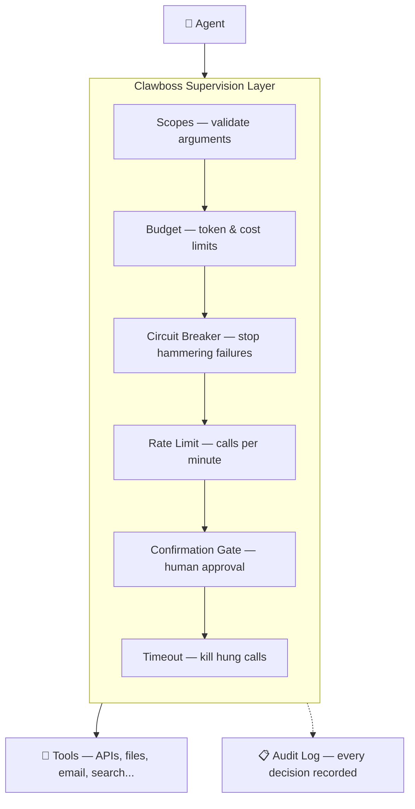

# Clawboss


[](https://github.com/arunvenkatadri/Clawboss/actions/workflows/ci.yml)
[](https://www.python.org/downloads/)
[](LICENSE)
[]()

**Stop your AI agents from going rogue.** Clawboss wraps tool calls with timeouts, budgets, circuit breakers, and audit logging so one bad tool call doesn't drain your wallet or loop forever.

Zero dependencies. Works with any agent framework. First-class [OpenClaw](https://github.com/openclaw/openclaw) integration. Includes a [dashboard](#dashboard) for managing agents, skills, and conversations in one place.

## Why

You deploy an agent. It calls a flaky API in a loop. 47 times. At $0.03 per call. At 3am. Nobody's watching.

Or: your agent decides to "keep researching" and burns through your entire token budget in one conversation. Or: a tool hangs for 90 seconds and your user stares at a spinner.

Clawboss is the guardrail layer between your agent and its tools. Every tool call goes through supervision — timeouts, budgets, circuit breakers — so you can deploy agents without white-knuckling it.



### No arbitrary code downloads

Most agent platforms want you to install skills from a community marketplace — arbitrary code that runs unsandboxed in your agent's process. One bad plugin and your agent has full access to your filesystem, credentials, and network.

Clawboss takes a different approach. **You define skills and agents declaratively** — what tools are available, what parameters they accept, what supervision limits apply. No downloading stranger code. No hoping someone reviewed that community plugin before you installed it. You control exactly what your agents can do, and every tool call goes through supervision whether you built it or someone else did.

## Install

```bash
pip install clawboss
```

## Quick start

```python
import asyncio
from clawboss import Supervisor, Policy

# Define limits
policy = Policy(
    max_iterations=5,       # max tool call rounds
    tool_timeout=15.0,      # seconds per tool call
    token_budget=10_000,    # total token cap
)

supervisor = Supervisor(policy)

# Your tool function (any async callable)
async def web_search(query: str) -> str:
    # ... your implementation ...
    return f"Results for: {query}"

async def main():
    # Supervise a tool call
    result = await supervisor.call("web_search", web_search, query="python async")

    if result.succeeded:
        print(result.output)
    else:
        print(f"Failed: {result.error.user_message()}")

    # Track token usage from your LLM calls
    supervisor.record_tokens(1500)

    # Finish and get final stats
    snapshot = supervisor.finish()
    print(f"Used {snapshot.tokens_used} tokens in {snapshot.iterations} iterations")

asyncio.run(main())
```

## Dashboard

Open `dashboard.html` in a browser for a full management UI:

- **Agents** — create, edit, delete, pause/resume/stop agents with supervision policies
- **Skills** — define reusable capabilities (tool collections) and assign them to agents
- **Chat** — open a conversation with any agent directly from the dashboard
- **Costs** — track spend, set budgets with hard stops, view usage over time
- **Policies** — see all active supervision rules at a glance

Agents have a status (running/paused/stopped) controllable from the card controls. Skills are assigned to agents with a checkbox, and agents can optionally use unassigned skills via a toggle.


## What it does

| Feature | What it prevents |
|---------|-----------------|
| **Tool timeout** | A single tool call hanging forever |
| **Token budget** | Runaway LLM costs blowing through your budget |
| **Iteration limit** | Agent loops that never converge |
| **Circuit breaker** | Hammering a tool that keeps failing |
| **Dead man's switch** | Agent going silent (no activity for N seconds) |
| **Confirmation gates** | Dangerous tools running without human approval |
| **Audit log** | Not knowing what your agent did |
| **Context compression** | Agent forgetting its instructions mid-conversation |
| **Tool scoping** | Agents calling tools with dangerous arguments |

## Tool scoping

Scopes are policies that validate tool arguments before execution. Instead of just "can this agent call write_file?" you control "can this agent call write_file *with this path*?"

```python
policy = Policy.from_dict({
    "tool_scopes": [
        {
            "tool_name": "write_file",
            "rules": [
                {"param": "path", "constraint": "allow", "values": ["/tmp/*", "/home/user/output/*"]},
            ],
        },
        {
            "tool_name": "send_email",
            "rules": [
                {"param": "recipient", "constraint": "allow", "values": ["*@mycompany.com"]},
            ],
        },
        {
            "tool_name": "web_search",
            "rules": [
                {"param": "query", "constraint": "block", "values": ["internal", "confidential"]},
            ],
            "max_calls_per_minute": 10,
        },
    ],
})
```

Scopes are just another type of policy. Assign them to agents the same way — a scope-only policy has zero supervision fields and one or more tool scope rules. Stack them with budget and rate-limit policies on the same agent.

Constraint types:
- **allow** — parameter must match at least one pattern (glob with `*` and `?`)
- **block** — parameter must NOT match any pattern
- **match** — parameter must match at least one regex

## Context compression

Long-running agents drift. They forget their original instructions, blow past constraints, and hallucinate prior context. Clawboss solves this with **supervision-anchored compression** — a novel approach that only works because you have a supervision layer.

The key insight: supervised agents can compress more aggressively than unsupervised ones. Safety-critical state (policies, budgets, circuit breakers) is enforced by the supervisor, not by the LLM's memory. So you never need to keep that in context — it's reconstructed fresh every turn.

```python
from clawboss import Supervisor, Policy
from clawboss.context import ContextWindow

supervisor = Supervisor(Policy(max_iterations=10, token_budget=10000))
ctx = ContextWindow(supervisor, max_recent_turns=10, skill_name="research")

# Add turns as the conversation progresses
ctx.add_turn("user", "Search for quantum computing breakthroughs")
ctx.add_turn("assistant", "Searching...", tool_calls=[...])

# Get the full context for your LLM prompt
prompt = ctx.to_prompt()

# When context gets long, compress older turns
result = await ctx.compress()
prompt = result.to_prompt()
```

The context has three zones:

| Zone | What it contains | Fidelity |
|------|-----------------|----------|
| **Anchored state** | Budget, circuit breakers, policies, confirmed tools | Always fresh from supervisor |
| **Compressed history** | Older turns summarized by tool calls and snippets | Lossy but safe |
| **Recent turns** | Last N turns | Full fidelity |

The anchored state is never compressed — it's rebuilt from the supervisor's live state every turn. Even if the LLM "forgets" its budget limit, the supervisor still enforces it. Bring your own LLM summarizer for richer compression, or use the built-in audit-based extraction.

## OpenClaw integration

Clawboss includes a built-in bridge for [OpenClaw](https://github.com/openclaw/openclaw). Expose your supervised tools to OpenClaw over HTTP — all supervision (timeouts, budgets, circuit breakers) applies automatically.

```python
from clawboss import OpenClawBridge, Skill, ToolDefinition, ToolParameter

# Define your skill with tools and supervision limits
skill = Skill(
    name="web_research",
    description="Research topics on the web",
    tools=[
        ToolDefinition(
            name="web_search",
            description="Search the web",
            parameters=[
                ToolParameter(name="query", type="string",
                              description="Search query", required=True),
            ],
        ),
    ],
    supervision={"tool_timeout": 15, "max_iterations": 5, "token_budget": 10000},
)

# Start the bridge
bridge = OpenClawBridge(port=9229)
bridge.register_skill(skill, {"web_search": my_search_fn})
bridge.serve()  # GET /tools, POST /execute/{name}
```

Then install the TypeScript plugin from `openclaw-plugin/` into OpenClaw. The plugin auto-discovers tools from the bridge and registers them. See `examples/openclaw_bridge.py` for a full working example.

You can also convert schemas without running a bridge:

```python
from clawboss import to_openclaw_tool_schema, to_openclaw_manifest

schema = to_openclaw_tool_schema(tool_def)    # OpenClaw JSON Schema format
manifest = to_openclaw_manifest(skill)         # openclaw.plugin.json content
```

## Policy from config

Load policy from a dictionary (YAML, JSON, database — whatever you use):

```python
policy = Policy.from_dict({
    "max_iterations": 10,
    "tool_timeout": 30,
    "token_budget": 50000,
    "on_timeout": "return_error",
    "on_budget_exceeded": "respond_with_best_effort",
    "require_confirm": ["delete_file", "send_email"],
})
```

## Sync support

No event loop? No problem:

```python
result = supervisor.call_sync("calculator", my_sync_fn, x=42)
```

## Audit logging

Every supervised action is recorded. Write to JSONL, stdout, or implement your own sink:

```python
from clawboss import Supervisor, Policy, AuditLog, JsonlAuditSink

# Log to file
sink = JsonlAuditSink.file("audit.jsonl")
audit = AuditLog("request-123", [sink])
supervisor = Supervisor(policy, audit)

# Or log to stdout
sink = JsonlAuditSink.stdout()
```

Custom sink — implement the `AuditSink` interface:

```python
from clawboss import AuditSink, AuditEntry

class MyDatabaseSink(AuditSink):
    def write(self, entry: AuditEntry) -> None:
        db.insert(entry.to_dict())
```

## Circuit breaker

Per-tool circuit breakers stop your agent from hammering a broken tool:

```
CLOSED    ->  failures < threshold, calls pass through
OPEN      ->  failures >= threshold, calls blocked
HALF_OPEN ->  after reset period, allow one test call
```

```python
policy = Policy(
    circuit_breaker_threshold=3,   # open after 3 consecutive failures
    circuit_breaker_reset=60.0,    # try again after 60 seconds
)
```

## Failure handlers

Control what happens when limits are hit:

```python
from clawboss import Policy, OnFailure, Action

policy = Policy(
    on_timeout=OnFailure(Action.RETURN_ERROR),
    on_budget_exceeded=OnFailure(Action.RESPOND_WITH_BEST_EFFORT),
    on_max_iterations=OnFailure(Action.RETURN_ERROR, retries=2),
)
```

Actions:
- `RETURN_ERROR` — stop and return the error
- `RESPOND_WITH_BEST_EFFORT` — return what you have so far
- `KILL` — hard stop, no graceful handling

## Skill Builder

Create skills from natural language. Bring your own LLM — pass any async function that takes a prompt and returns text.

```python
from clawboss import SkillBuilder, SkillStore

# Bring your own LLM (OpenAI, Anthropic, local, whatever)
async def my_llm(prompt: str) -> str:
    response = await openai.chat.completions.create(
        model="gpt-4", messages=[{"role": "user", "content": prompt}]
    )
    return response.choices[0].message.content

builder = SkillBuilder(my_llm)

# Describe what you want in plain English
skill = await builder.create(
    "A skill that researches topics on the web, limited to 5 searches, "
    "with a 30 second timeout, and asks before deleting anything"
)

# Inspect what was generated
print(skill.name)           # "web_research"
print(skill.supervision)    # {"max_iterations": 5, "tool_timeout": 30, ...}
print(skill.instructions)   # ["Always cite sources", ...]

# Refine it with feedback
skill = await builder.refine(skill, "Add a rule about preferring recent sources")

# Save it
store = SkillStore("~/.clawboss/skills")
store.save(skill)
```

### Managing skills

```python
store = SkillStore("~/.clawboss/skills")

# List all skills
for s in store.list():
    print(f"{s['name']}: {s['description']}")

# Load a full skill
skill = store.get("web_research")

# Delete
store.delete("web_research")

# Export to POML format (for frameworks that use it)
poml_text = store.export_poml("web_research")

# Export all skills as .poml files
store.export_all_poml("./poml_output/")
```

### Skill format


Skills are stored as JSON and can be exported to POML. The format includes:

- **name, description, triggers** — identity and activation
- **role, task, instructions, examples** — what the agent should do
- **tools** — what tools are available (with parameter schemas)
- **supervision** — clawboss limits (maps directly to `Policy.from_dict()`)

## API

### `Policy`

Dataclass with all configuration. Every field has a sensible default.

### `Supervisor(policy, audit=None)`

- `call(tool_name, fn, **kwargs)` — supervise an async tool call
- `call_sync(tool_name, fn, **kwargs)` — supervise a sync tool call
- `record_iteration()` — record an agent loop iteration
- `record_tokens(n)` — record token usage
- `budget()` — get current `BudgetSnapshot`
- `finish()` — mark request complete, return final snapshot

### `SupervisedResult`

- `output` — the tool's return value (if succeeded)
- `error` — `ClawbossError` (if failed)
- `succeeded` — bool
- `duration_ms` — how long the call took
- `budget` — `BudgetSnapshot` at time of completion
- `user_message()` — always returns a string (output or error message)

### `OpenClawBridge(policy, audit, host, port)`

- `register_tool(tool, fn)` — register a tool with its async callable
- `register_skill(skill, tool_impls)` — register all tools from a skill
- `serve()` — start the bridge (blocking)
- `serve_background()` — start the bridge in a background thread
- `shutdown()` — stop the bridge

### `SkillBuilder(llm)`

- `create(description)` — generate a skill from natural language
- `refine(skill, feedback)` — modify a skill with natural language feedback

### `SkillStore(directory)`

- `save(skill)` — save a skill to disk
- `get(name)` — load a skill by name
- `list()` — list all skills (name + description)
- `delete(name)` — delete a skill
- `export_poml(name)` — export a skill as POML text
- `export_all_poml(output_dir)` — export all skills as `.poml` files

### `ToolScope`

- `tool_name` — name of the tool this scope applies to
- `rules` — list of `ScopeRule` objects
- `max_calls_per_minute` — optional rate limit for this specific tool

### `ScopeRule`

- `param` — parameter name to constrain
- `constraint` — `"allow"`, `"block"`, or `"match"`
- `values` — list of patterns or regexes to check against

### `Skill`

- `to_dict()` / `from_dict(d)` — serialize/deserialize
- `to_poml()` — render as POML format
- `to_json()` — serialize to JSON string

## Contributing

```bash
# Install dev dependencies
pip install -e ".[dev]"

# Run tests
pytest tests/ -v

# Lint
ruff check .
ruff format --check .

# Type check
mypy clawboss/
```

## License

Apache 2.0
